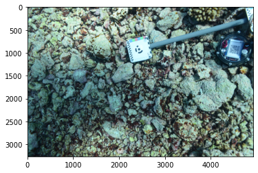
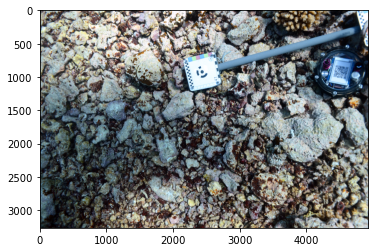
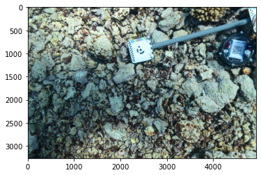
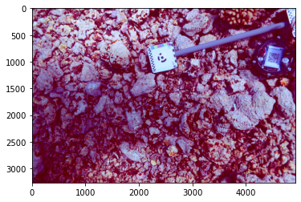
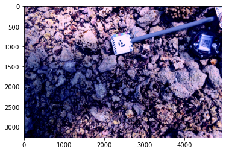
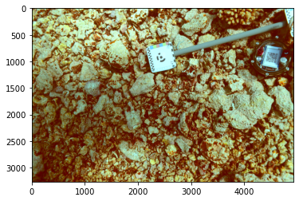
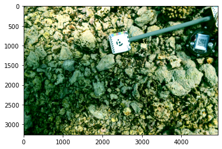

# color-correction-tool

color-correction-tool is a Python and NumPy based module reimplement from a [JS library](https://github.com/nikolajbech/underwater-image-color-correction)  of color correction of images taken in the water. 

## Installation

Use the [git clone command](https://pip.pypa.io/en/stable/) to clone the project repo.

```bash
git clone https://github.com/JosephLWalker96/underwater-object-detection
```

## Usage

After the installation, set the PATH variable, and import the module and necessary dependencies.

```python
# Add the repo to PATH
import sys
sys.path.append('/home/c8wu/projects/object_detection/underwater-object-detection/color-correction-tool/src')

# Import color correction module
import color_correction

# Import necessary dependencies
import numpy as np
import cv2
import pandas as pd
import matplotlib.pyplot as plt
```

Read in the image.
```python
# Read the image
img = cv2.imread(["SAMPEL_IMAGE_DIR")

# Use matplotlib to show the image in RGB color space
plt.imshow(img)
```



## Output

To get the result, call `color_correction.color_correction(img)` . The resulting image is color corrected on the default behavior.

### color correction default behavior: adjustment_intensity = 1, x = 0, y = 0

```python
res = color_correction.color_correction(img)

plt.imshow(res)
```



### attribute adjustment_intensity that enables learning of depth, i.e. the red shift amount. Domain of adjustment_intensity: [0,+). Example adjustment_intensity = 10

```python
res = color_correction.color_correction(img, adjustment_intensity = 10)

plt.imshow(res)
```


### adjustment_intensity = 0

```python
res = color_correction.color_correction(img, adjustment_intensity = 0)

plt.imshow(res)
```



### attributes x and y that allows neuro network to adjust the hew. The corrected image is pinkish: x > 0, y > 0.

```python
res = color_correction.color_correction(img, x = 1, y = 1)

plt.imshow(res)
```



### attributes x and y that allows neuro network to adjust the hew. The corrected image is purplish: x > 0, y < 0.

```python
res = color_correction.color_correction(img, x = 1, y = -1)

plt.imshow(res)
```



### attributes x and y that allows neuro network to adjust the hew. The corrected image is yellowish: x < 0, y > 0.

```python
res = color_correction.color_correction(img, x = -1, y = 1)

plt.imshow(res)
```



### attributes x and y that allows neuro network to adjust the hew. The corrected image is greenish: x < 0, y < 0.

```python
res = color_correction.color_correction(img, x = -1, y = -1)

plt.imshow(res)
```



## License
[MIT](https://choosealicense.com/licenses/mit/)
